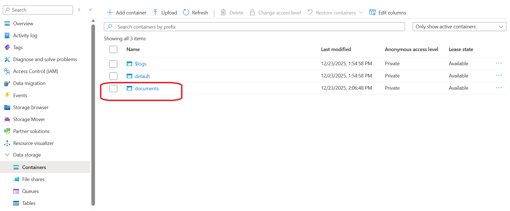
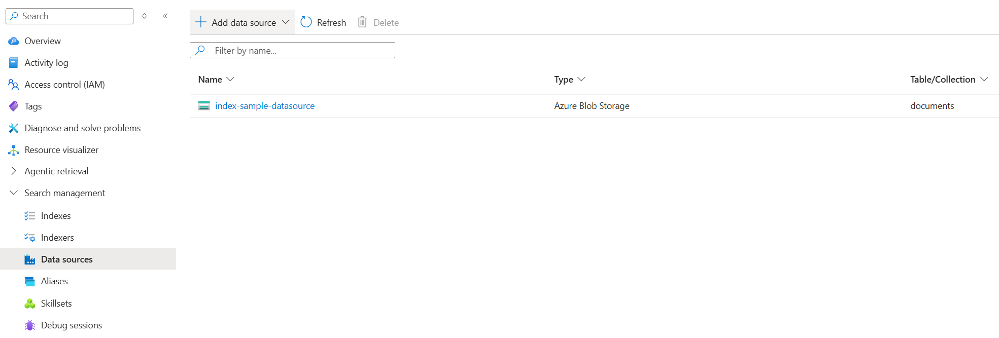
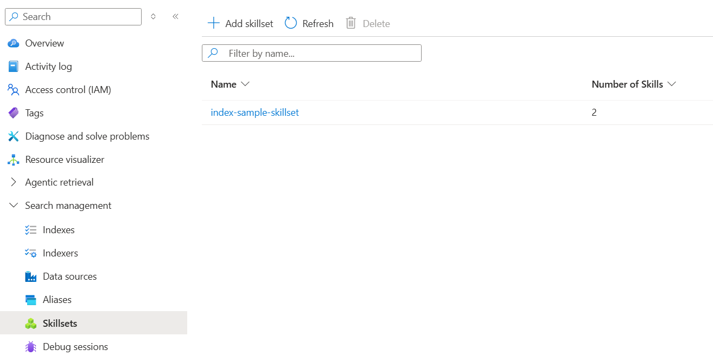
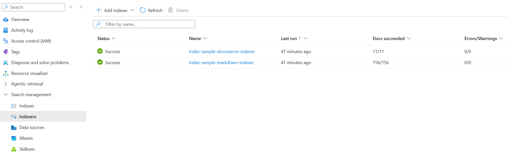
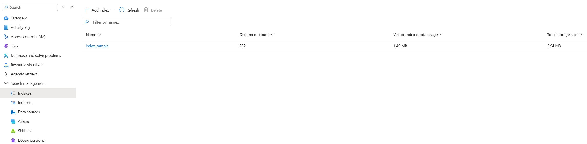

# Azure AI Search Setup Guide
## Overview
The Azure AI Search feature improves responses by letting the agent pull context from indexed documents. It is optional and disabled by default; set `USE_AZURE_AI_SEARCH_SERVICE=true` **before your first `azd up`** so that run will provision the search resources.

## How does Azure AI Search works?
When enabled, the app uploads the `.md` and `.pdf` files in `src/files` to your Azure Storage account and indexes them for hybrid search. Files go into the `documents` container (override with `AZURE_BLOB_CONTAINER_NAME`). The search index is created automatically and includes semantic + vector search with a `title` field for references.

## Environment variables (set before first `azd up`)
- `USE_AZURE_AI_SEARCH_SERVICE`: Set to `true` to enable AI Search; must be set before the first `azd up` to provision search resources.
- `AZURE_AI_SEARCH_INDEX_NAME`: Name of the search index to create/use (default `index_sample`).
- `AZURE_AI_EMBED_DEPLOYMENT_NAME`: Embedding deployment name used for vectorization.
- `AZURE_BLOB_CONTAINER_NAME`: Optional override for the blob container name (default `documents`).

## Indexing pipeline (what happens on startup)
When `USE_AZURE_AI_SEARCH_SERVICE=true` and the app sees no agent yet, it builds the AI Search tool in these steps. Each step is skipped if the resource already exists; nothing is overwritten unless missing:

1) Blob container
	- Check for the `documents` container; create it if missing.

2) Upload seed files
	- If the container is empty, upload everything under `src/files`.
	- If blobs already exist, skip upload to avoid overwriting user content.

3) Search index
	- Create the search index with semantic + vector config if it doesn’t exist; otherwise reuse it.

4) Datasource
	- Create the blob datasource pointing to `documents`; reuse it if already present.

5) Skillset
	- Create the split + embedding skillset; reuse it if already present.

6) Indexers
	- Create two indexers if missing: one for `.md` (markdown parsing) and one for `.pdf,.docx,.pptx,.xlsx,.txt` (default parsing).
	- Both indexers write chunks, vectors, and set `title` from the blob file name (`metadata_storage_name`).

## Resource naming from the index name
- The index name comes from `AZURE_AI_SEARCH_INDEX_NAME` (default to: `index_sample`).
- Names are sanitized (lowercase, underscores → hyphens) to comply with Azure Search resource naming rules (example: `index-sample`).
- Skillset: `<sanitized>-skillset`.
- Datasource: `<sanitized>-datasource`.
- Indexers: `<sanitized>-markdown-indexer` and `<sanitized>-documents-indexer`.

## Viewing resources in Azure Portal (with screenshots)
- Blob container/files: In Storage **Containers**, open `documents` (or your override). 
- Datasource: In AI Search **Data sources**, open `<sanitized>-datasource`. 
- Skillset: In **Skillsets**, open `<sanitized>-skillset` to see split + embedding skills. 
- Indexers: In **Indexers**, find `<sanitized>-markdown-indexer` and `<sanitized>-documents-indexer`; check run history here. 
- Index: In **Indexes**, open `AZURE_AI_SEARCH_INDEX_NAME` to review fields, vector, and semantic settings. 

## Deployment and drift
- Changes you make directly in Azure (index, indexers, skillset, or files in the `documents` container) are kept; `azd up`/`azd deploy` will only recreate these if they are missing.
- If the agent resource used by the web app is deleted, a subsequent `azd up` or `azd deploy` will provision a new agent and recreate any missing AI Search assets (index, indexers, datasource, skillset).

## If you want to use your own dataset
- Drop your `.md` and `.pdf` files into `src/files` (or point the upload step to your folder).
- If you already ran `azd up` and the `documents` container exists, delete that container to clear old files before redeploying.
- Run `azd up` or `azd deploy` to recreate the container and upload your files.
- After deployment, run the indexers (from the Azure Portal or CLI) so the new content is processed into the search index.

